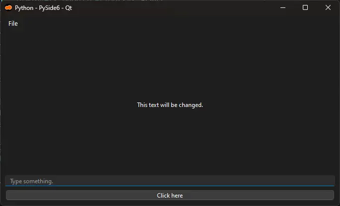

<br>

[](./README.md)
[](./README.md.pt-br.md)

# Example of how to structure a project with Python and Qt

[](https://github.com/natorsc/app-pyside-ui "Go to the repository.")
&emsp;
[](https://github.com/natorsc/app-pyside-ui)
&emsp;
[](https://github.com/natorsc/app-pyside-ui)

[](https://badges.mit-license.org/)

[](https://python-poetry.org/)

## 📝 Description

Repository displays a way of structuring a project that uses the Python programming language to create an application with the PySide6 binding and Qt graphical toolkit (UI).

### ToDo

- [x] Perform translations with [Qt Linguist](https://doc.qt.io/qt-6/qtlinguist-index.html) software. 'pyside6-linguist'.
- [x] Standardize the generation of translation files ('*.ts'). 'pyside6-lupdate'.
- [x] Standardize the compilation of translation files ('*.qm'). `pyside6-lrelease`.
- [x] Standardize the compilation of resources '*.qrc'. `pyside6-rcc`.
- [x] Create a binary/executable. 'pyside6-deploy'.
- [x] Create a Python package (`*.tar.gz` e `*.whl`). `poetry build`.
- [x] Create Tests. `python -m unittest`.
- [x] Create a [Github Actions](https://github.com/features/actions) (`deploy-nuitka.yaml`) to automate the deployment process with Nuitka.
- [x] Create a Github Actions (`pdm-test-pypi.yaml`) to automate the submission of python package (`*.tar.gz' and '*.whl`) to [https://test.pypi.org/](https://test.pypi.org/).

---

## 🛠 Technologies used

To date, the following technologies have been used in the construction of the project:

[](https://www.python.org/ "Go to the website.")
&emsp;
[](https://www.qt.io/ "Go to the website.")
&emsp;
[](https://pypi.org/project/PySide6/ "Go to the PyPi.")
&emsp;
[](https://python-poetry.org/ "Go to the website.")

---

## 🤓 Author

Repository made with 💙 by [Renato Cruz](https://github.com/natorsc) 🤜🤛 Get in touch!

[](mailto:natorsc@gmail.com "Send email.")

Acompanhe conteúdos sobre programação e tecnologia em:

[](https://justcode.com.br/ "Go to the website.")

One of the playlists that I usually listen to when I'm studying or "coding" 😁:

[](https://open.spotify.com/playlist/1xf3u29puXlnrWO7MsaHL5?si=A-LgwRJXSvOno_e6trpi5w&utm_source=copy-link "Acessar playlist.")

---

## 💝 Donations

Thank you for your donation, it is through her that I am able to keep this content 😊.

### Buy me a coffee

[](https://www.buymeacoffee.com/natorsc "Help sustain this project with a donation.")


### Ko-Fi

[](https://ko-fi.com/natorsc "Help sustain this project with a donation.")


### Pix


**Chave**: `b1839493-2afe-484d-9272-82a3e402b36f`

---

## Extra

### Errors

If you run the code and see the alert:

```bash
qt.qpa.plugin: Could not find the Qt platform plugin "wayland" in ""
```

install the `qt6-wayland` package on your Linux distribution.

### Qt

- [Blog](https://www.qt.io/blog).
- [Qt Documentation](https://doc.qt.io/).
- [Qt for Python Documentation](https://doc.qt.io/qtforpython-6/).

### KDE

- [Official Site](https://kde.org/).
- [Blogs](https://blogs.kde.org/).
- [Adventures in Linux and KDE](https://pointieststick.com/).
- [KDE Human Interface Guidelines (HIG)](https://develop.kde.org/hig/).

### Icons

- [Cuttlefish](https://develop.kde.org/docs/features/icons/). O Cuttlefish pode ser instalado através do pacote plasma-sdk.
- [Breeze (CDN)](https://cdn.kde.org/breeze-icons/icons.html).

### RADs

- [Qt Designer](https://doc.qt.io/qt-6/qtdesigner-manual.html).

### IDEs

- [https://www.qt.io/product/development-tools](https://www.qt.io/product/development-tools).

### Design

- [Qt Design Studio](https://www.qt.io/product/ui-design-tools).

---
